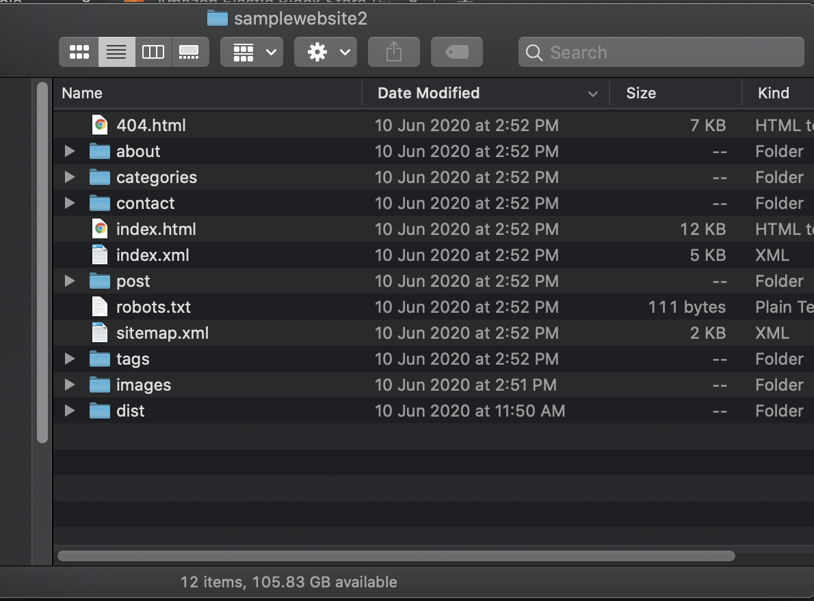
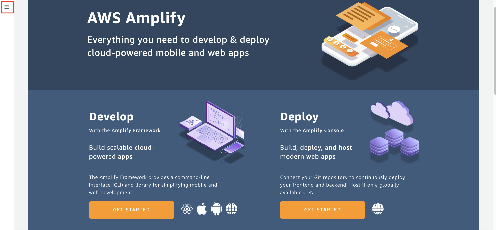

# Web Static Deployment using AWS Amplify

1. Go to [this link](https://bit.ly/3eoehlc) to download sample code.

The files will look like this.
    

2. Go to [AWS Console](https://ap-southeast-1.console.aws.amazon.com/console/home?region=ap-southeast-1)
3. Type `Amplify` and click the Amplify menu
    
4. in amplify page, click the 3 strips bar at the top left side
    
5. click "All apps"
    
6. in apps page, click "Connect app"
    
7. in choosing the code source, choose "Deploy without Git provider"
8. click "Continue"
    
9. in App Name, Type "(yourname)-amplify-app"
10. in environment name, type "test"
11. in method, click "Drag and drop"
    
12. in Drag and drop, click "Choose files" and find your zip file that has been downloaded in step 1.
13. click "Save and deploy"
    

it will display that deployment has been successfully completed.

14. click the domain link.
    

it will display the website that we have uploaded.
    

[BACK TO WORKSHOP GUIDE](../README.md)