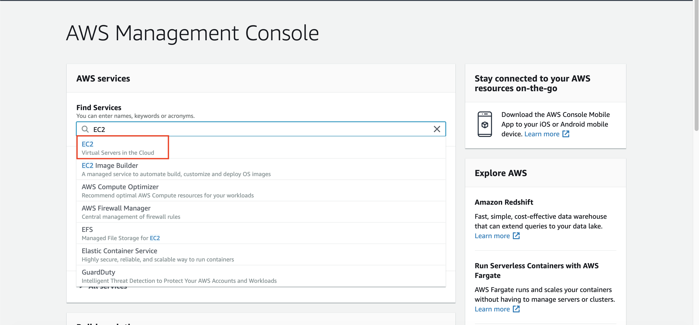
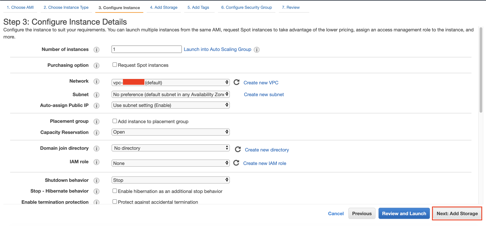
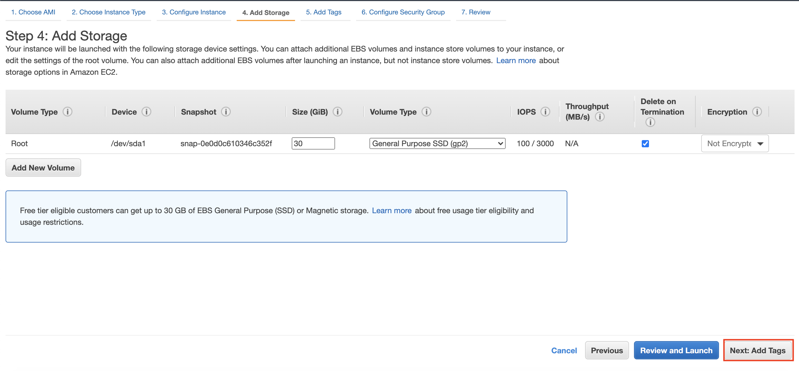
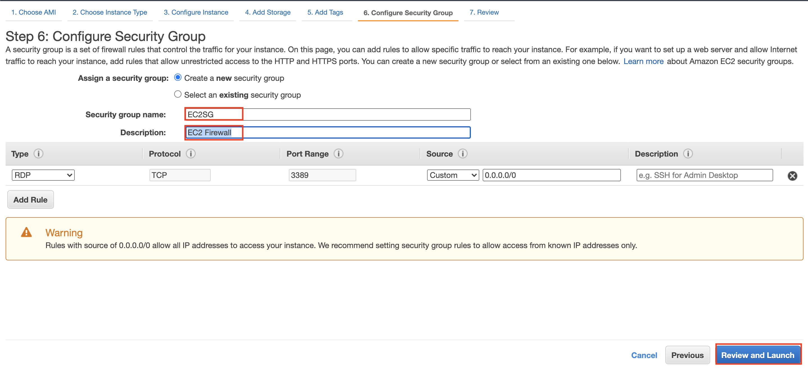

# Windows Virtual Machine (EC2) in cloud 

1. Go to [AWS Console](https://ap-southeast-1.console.aws.amazon.com/console/home?region=ap-southeast-1)
2. Type `EC2` and click the EC2 menu
    
3. Click `Instances` at the left menu
4. Click `Launch instances`
    
5. in Choose an Amazon Machine Image, Find `Microsoft Windows Server 2019 Base` and click `Select`
    
6. in Choose an Instance Type, click `t2.micro` and click `Next: Configure Instance Details`
    

There will be configure instance details page. Right here, we can setup the network, subnet, roles, etc.

7. in Configure instance details, click `Next: add storage`
    

In storage, it is going to use Elastic Block Store to create block storage for EC2 instance.

8. in Add Storage, click `Next: add tags`
    

Tags are useful to group the EC2 instance into one. We can group it based on the project that it involves. Example, There will be 5 EC2 running and 2 of them is for Project A. Therefore, we can give tags to 2 EC2 instances and group them into one. We will put the key as `Project` and Value as `A` for this case. Right now, we can skip this step for the sake of simplicity.

9. in tags, click `Next: Configure Security Group`
    

Security group is an instance-based Firewall. It allows which traffic that is going to be accessible to the instance.

10. in Security group name, change it to `EC2SG`
11. change the Description to `EC2 Firewall`
12. Click `Review and Launch`
    
13. click `Launch`

There will be a pop-up menu asking about key pair. Key pair is necessary for accessing the instance. Without it, you are not allowed to access your Instance.

14. Click `Create a new key pair`
15. in key pair name, type `WindowsKeyPair`
16. click `Download Key Pair`

It will download a Key Pair File into your device.

17. click `Launch Instances`.
    

it will display the notification stated that `Your instances are now launching`

18. click `View Instances` at the bottom page

you will see that the instance is currently running, but still `initializing` the status check. For every newly created instance, it needs to pass the status check. it may take few minutes to complete it. You may click refresh button to check if the instance has been passed the status check.
    

Once the status has been completed, it will show `2/2 checks passed`.
    

Now, we can try to connect to our instance.

19. click the checkbox at the left side of your instance.
20. click `Connect`
    

it will show the connect to instance page. Now, go to RDP Client page.

21. Click `Download remote desktop file`

It will download the remote desktop file to access the instance.

22. click `Get password` at password area.
    

it will ask you WindowsKeyPair that has been downloaded at your device.

23. click `Browse` and find your WindowsKeyPair file.
24. click `Decrypt Password`
    

it will display the password for you to access your instance.

25. copy Public DNS, User name, and the password. you are going to use it for accessing the instance.
    
26. Open remote desktop file we have downloaded from step 21.
27. in PC Name, input your Public DNS.
28. for user name, input the user name we have copied.
29. for password, input the password we got from previous step.

It will be successfully connected to your Windows server.

[BACK TO WORKSHOP GUIDE](../README.md)