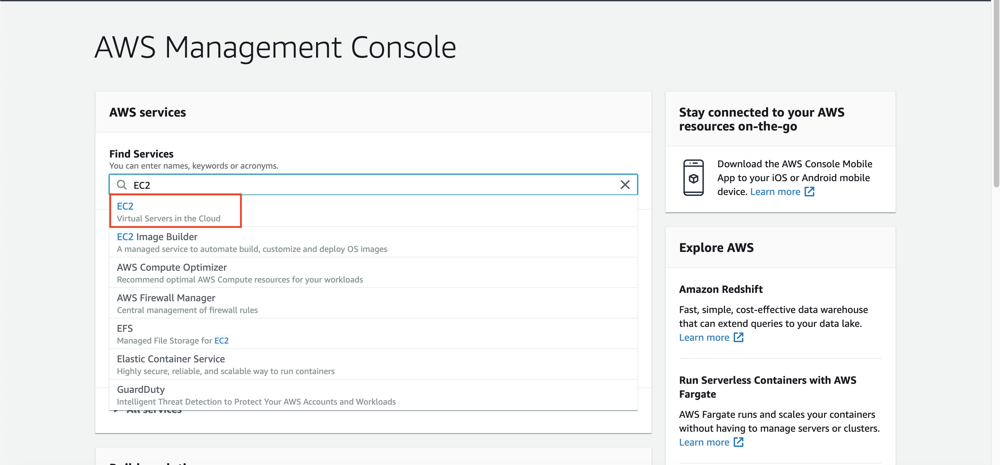
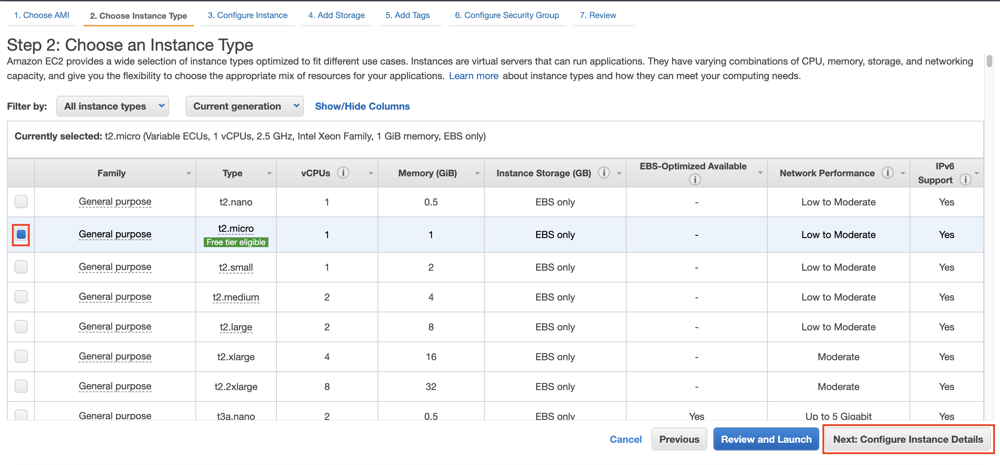
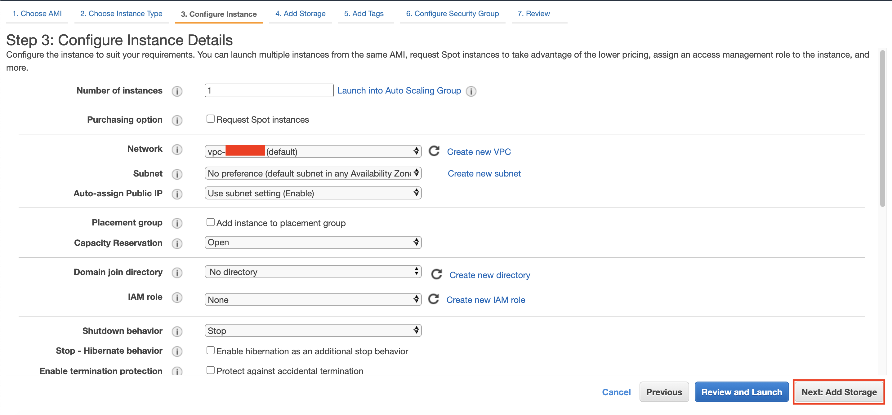
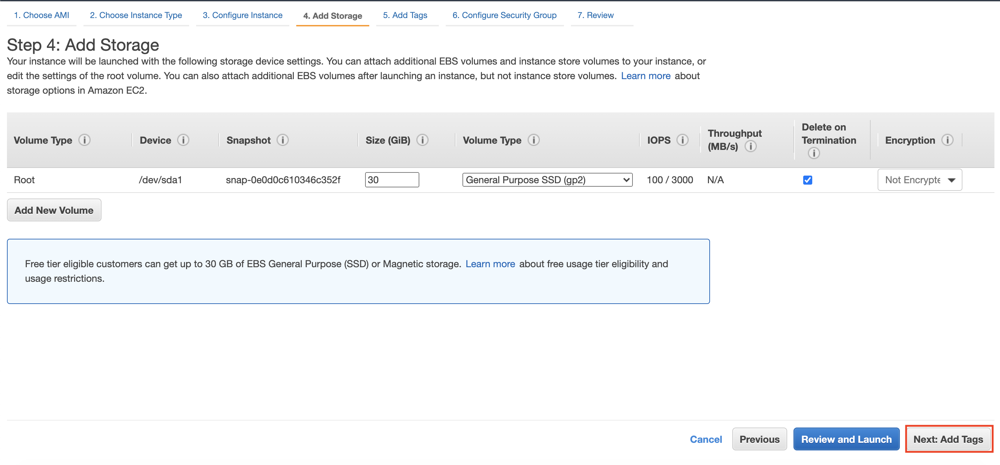
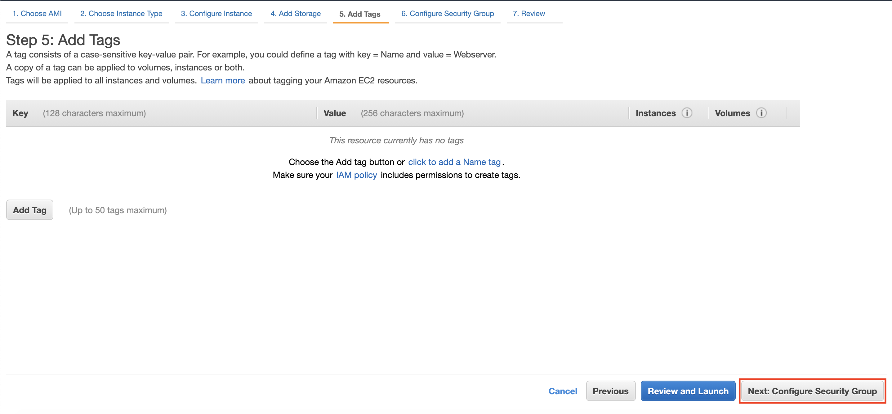
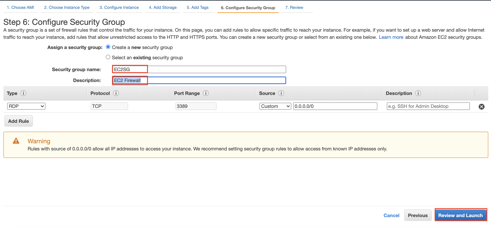
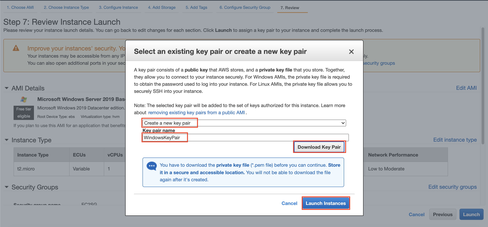

# Object Storage using Simple Storage Service (S3)

1. Go to [AWS Console](https://ap-southeast-1.console.aws.amazon.com/console/home?region=ap-southeast-1)
2. Type `S3` and click the S3 menu
    
3. in S3 bucket page, click "Create Bucket"
    

There will be a create bucket pop-up menu.

In Simple Storage Service, bucket name must be unique, meaning that for every bucket cannot have the same name with the other buckets. Make sure to name your bucket properly.

4. in bukcet name, type "(yourname)-s3-workshop"
5. Make sure the region is in "Acia Pacific (Singapore)"
6. click "Next"
    

The next page will configure the properties. In properties page, we can enable versioning for the object. this also anticipate accidental deletion for an object and retain the version changes for each objects. There will also be tags, just like EC2.

7. in properties page, click "Next"
    

S3 bucket can be publicly accessible. It depends on what object you are going to store. If you save a very private and confidential files, we don't recommend to make the bucket public. For this workshop, we don't need public access in a bucket.

8. in block public access, make sure to check "Block all public access" and click "Next" 
    
9. In review page, click "Create bucket"
    

It will create a bucket immediately. Now, we can open our bucket.

10. Click your bucket name.
    

It will display the bucket. Now, we are going to upload a file.

11. Download [this file](../images/S3/AWSLogo.png)
12. in S3 Bucket page, click "Upload"
    
13. click "Add Files" and find the image that you have downloaded.
14. The page will display the file you have chosen. Now, click "Next"
    
15. in manage users page, click "Next"
    
16. in storage class, choose "Standard" and click "Next"
    
17. in Review, click "Upload"
    

It will display the image at our bucket.

[BACK TO WORKSHOP GUIDE](../README.md)